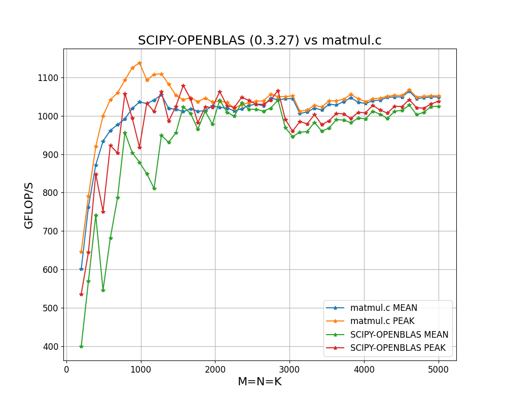
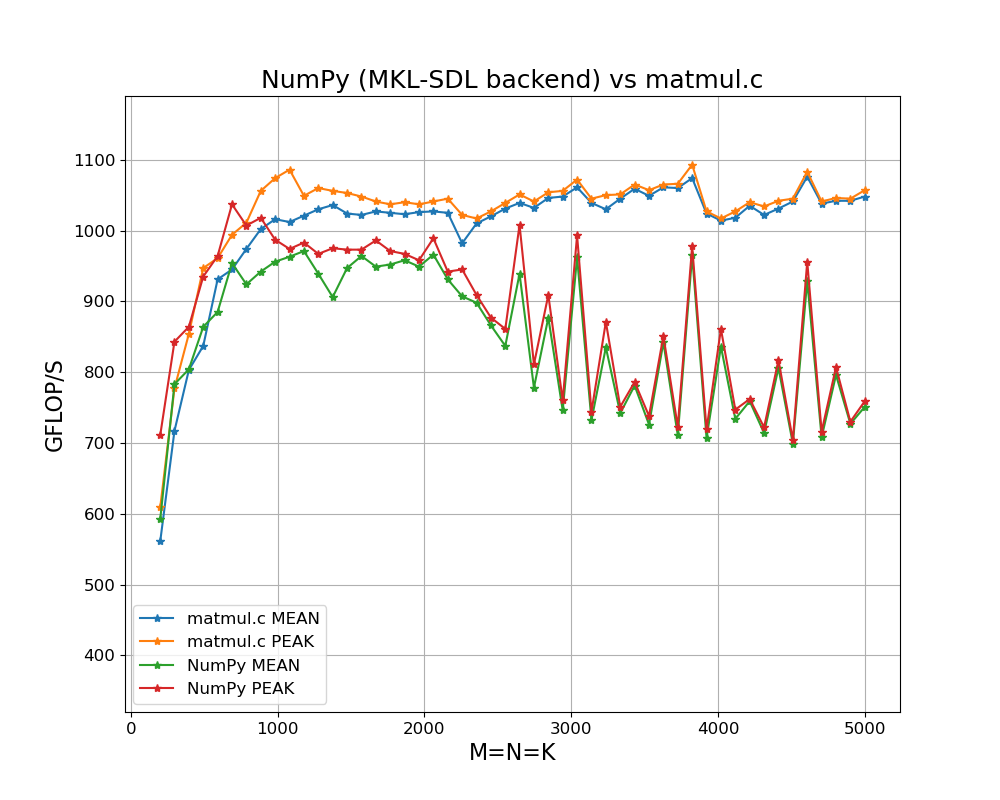
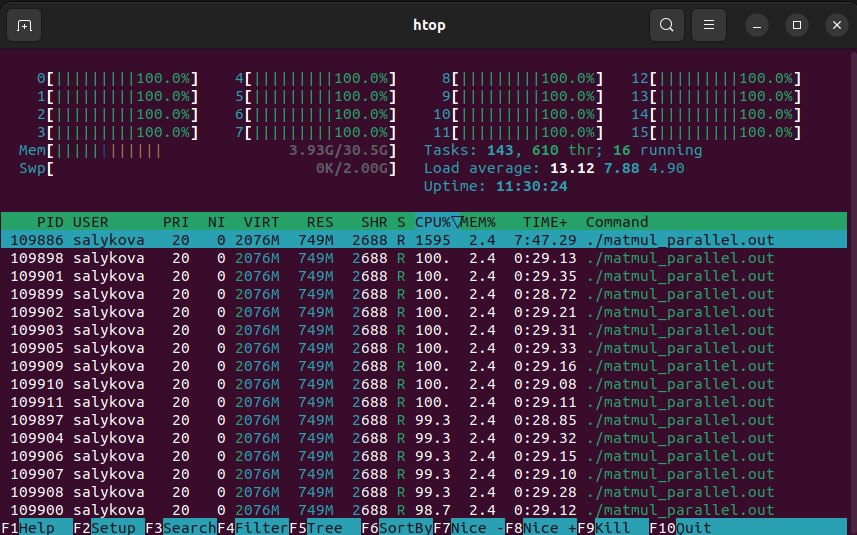

# High-Performance Matrix Multiplication on CPU

> **Important!** The code should be compiled with Clang. GCC causes the program to run 1.5 to 2 times slower on my machine. Please don’t expect peak performance without fine-tuning the hyperparameters, such as the *number of threads, kernel and block sizes*, unless you run it on a Ryzen 7700(X). More on this in the [tutorial](https://salykova.github.io/matmul-cpu).

## Key Features
- Simple and scalable C code (<150 LOC)
- Works for arbitrary matrix sizes
- Faster than NumPy with OpenBLAS and MKL backends (tested on Ryzen 7700)
- Step by step [tutorial](https://salykova.github.io/matmul-cpu)
- Efficiently parallelized with just 3 lines of OpenMP directives
- Targets x86 processors with AVX2 and FMA3 instructions (=all modern Intel Core and AMD Ryzen CPUs)
- Follows the [BLIS](https://github.com/flame/blis) design
- Intuitive API `void matmul(float* A, float* B, float* C, const int M, const int N, const int K)`

## How to use
For quick testing, fine-tuning, and prototyping, use the standalone file `matmul.c` in the main folder:
```
clang-17 -O2 -mno-avx512f -fopenmp -march=native matmul.c -o matmul.out && ./matmul.out
```
To verify the numerial accuracy, add `-DTEST`:
```
clang-17 -O2 -mno-avx512f -fopenmp -march=native -DTEST matmul.c -o matmul.out && ./matmul.out
```

## Performance

Tested on:
- CPU: Ryzen 7 7700 8 Cores, 16 Threads
- RAM: 32GB DDR5 6000 MHz CL36
- Numpy 1.26.4
- Compiler: `clang-17`
- Compiler flags: `-O2 -mno-avx512f -march=native`
- OS: Ubuntu 22.04.4 LTS

<p align="center">
  
</p>

<p align="center">
  
</p>

To reproduce the results, run:
```bash
python benchmark_numpy.py

clang-17 -O2 -mno-avx512f -march=native -fopenmp benchmark.c -o benchmark.out && ./benchmark.out

python plot_benchmark.py
```
<p align="center">
  
</p>
