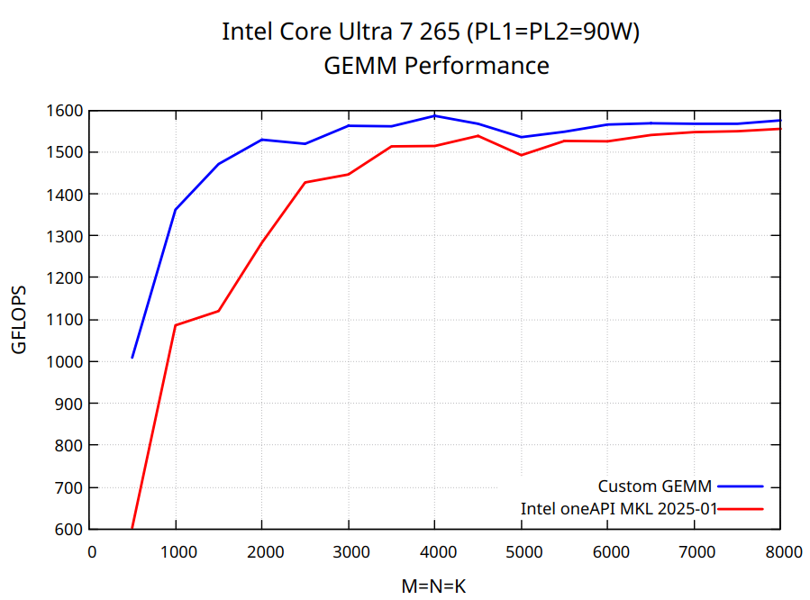
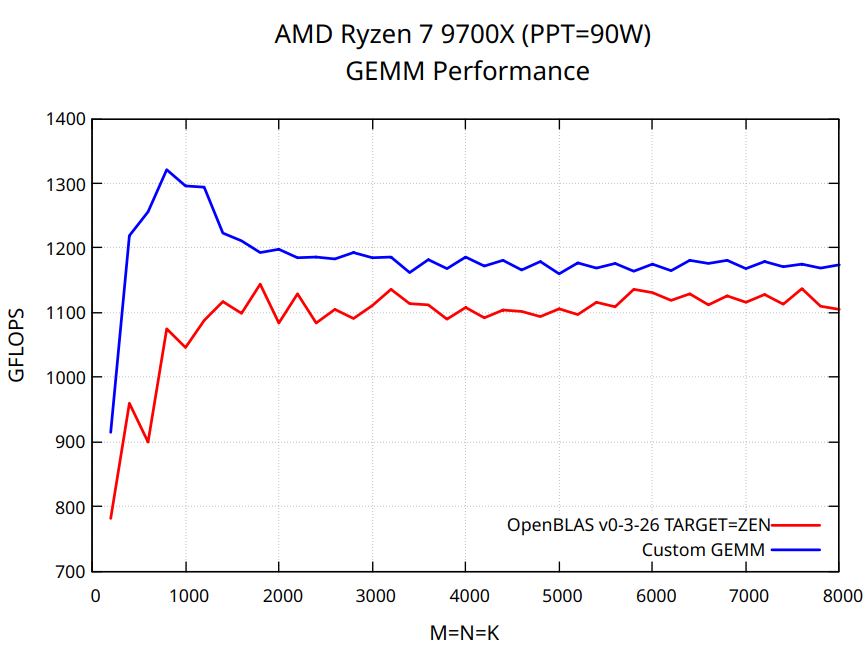

# Advanced GEMM Optimization on Modern Multi-Core x86 Processors

> **Important note:** in the current implementation, the *multithreading strategy, number of threads and tile sizes* have been specifically optimized for AMD Ryzen 7 9700X and Intel Core Ultra 265 processors to achieve maximum performance. Depending on your CPU, you may need to fine-tune these parameters and choose an alternative parallelization strategy for optimal performance. More details can be found in the [tutorial](https://salykova.github.io/matmul-cpu). For instance, on many-core server processors, it’s recommended to use nested parallelism and to parallelize multiple loops around the micro-kernel.

## Key Features

- Performance comparable to modern BLAS libraries
- Simple and compact implementation in C, no assembly code
- Step by step, beginner-friendly [tutorial](https://salykova.github.io/matmul-cpu)
- Multithreading via OpenMP
- High-level design follows [BLIS](https://github.com/flame/blis)

## Prerequisites

Install the following packages via `apt` if you are using a Debian-based Linux distribution

```bash
sudo apt-get install cmake build-essential gnuplot libomp-dev
```

## Performance

Test environment:

- CPUs: AMD Ryzen 7 9700X @ 90W, Intel Core Ultra 265 @ 90W
- RAM: DDR5 7000 MHz CL36
- Compiler: GCC 13.3.0
- OS: Ubuntu Ubuntu 24.04.1 LTS

<p align="center">
  
</p>

<p align="center">
  
</p>

To benchmark the implementation, run the following script:

```bash
bash scripts/benchmark.sh NTHREADS OMP_SCHEDULE
```

Replace `NTHREADS` with the number of CPU cores (or CPU threads if your CPU supports hyper-threading). The variable `OMP_SCHEDULE` controls how loop iterations are distributed across threads aka load balancing. For Intel Core processors with P and E cores, use `OMP_SCHEDULE=dynamic`. For AMD processors, either `OMP_SCHEDULE=auto` or `OMP_SCHEDULE=static` typically yields better results. For example, on an Intel Core Ultra 265 use the following command:

```bash
bash scripts/benchmark.sh 20 dynamic
```

For optimal performance fine-tune the tile sizes `MC, NC, KC` in `src/matmul.c`. The benchmark parameters such as `MINSIZE`, `STEPSIZE`, `NPTS` and etc. can be adjusted in `scripts/benchmark.sh`.

## Tests

```bash
bash scripts/test.sh NTHREADS OMP_SCHEDULE
```
