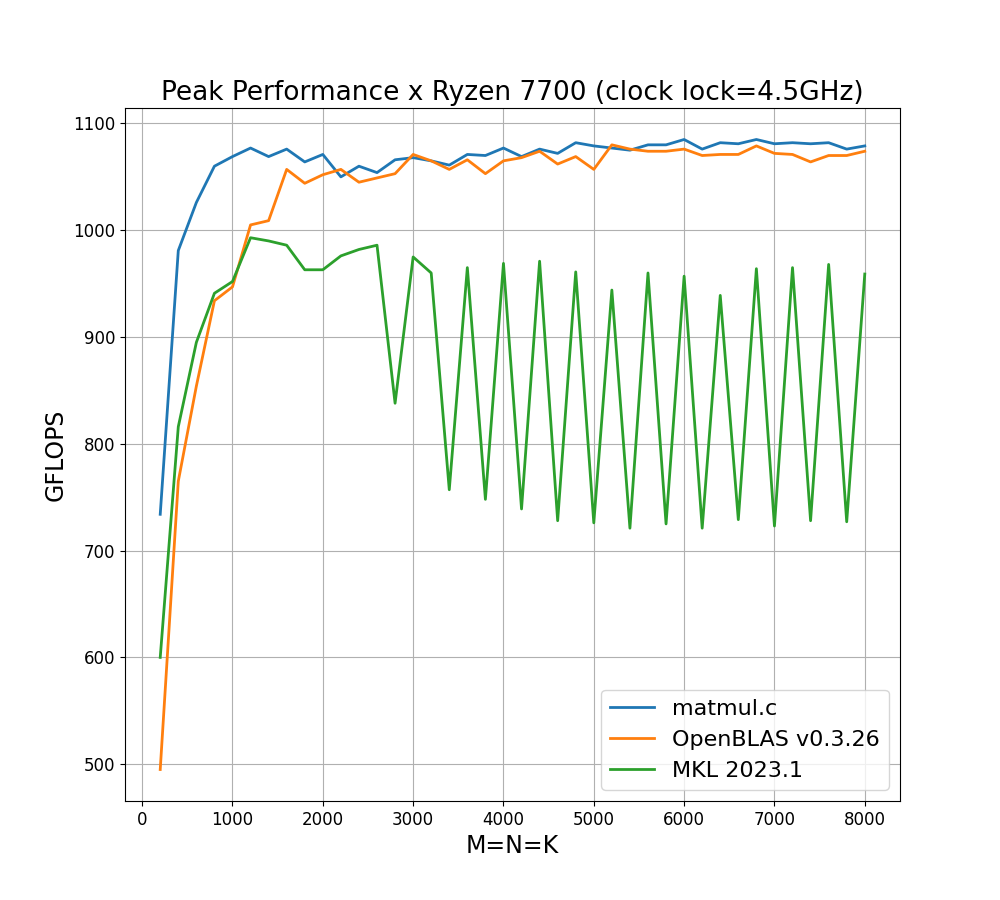

# Fast, Multi-threaded Matrix Multiplication in C from Scratch

> **Important note:** Please don’t expect peak performance without fine-tuning hyperparameters such as the *number of threads, kernel size and block sizes*, unless you're running it on a Ryzen 7700(X). The current implementation includes a single kernel and a parallelization strategy, both optimized for AMD Zen CPUs. For manycore processors (> 16 cores), consider utilizing nested parallelism and parallelizing 2-3 loops to increase the performance (e.g., the 5th, 3rd, and 2nd loops around the kernel). More on this in the [tutorial](https://salykova.github.io/matmul-cpu).

## Key Features
- Step by step, beginner-friendly [tutorial](https://salykova.github.io/matmul-cpu)
- Simple and scalable C code
- Supports arbitrary matrix sizes
- Faster than OpenBLAS and MKL on Ryzen 7700
- Efficiently parallelized with just 3 lines of OpenMP directives
- Targets x86 processors with AVX2 and FMA3 instructions (=all modern Intel Core and AMD Ryzen CPUs)
- Follows the [BLIS](https://github.com/flame/blis) design

## Installation
Install the following packages via `apt` if you are using a Debian-based Linux distribution
```bash
sudo apt-get install cmake build-essential python3-dev python3-pip libomp-dev
```
Create the virtual environment using `pip` or `conda` e.g.
```bash
python3 -m venv .venv
source .venv/bin/activate
```
and install the Python dependencies
```bash
python -m pip install -r requirements.txt
```
### Optional:
To benchmark OpenBLAS, start by installing it according to the [installation guide](https://github.com/OpenMathLib/OpenBLAS/wiki/Installation-Guide). During the installation, ensure you set an appropriate TARGET and disable AVX512 instructions. For instance, if you're using Zen4/5 CPUs, compile OpenBLAS with:
```bash
make TARGET=ZEN
```
Otherwise, OpenBLAS defaults to AVX512 instructions available on Zen4/5 CPUs.


## Performance

Test enviroment:
- CPU: Ryzen 7 7700 8 Cores, 16 Threads
- CPU LOCKED CLOCK SPEED: 4.5GHz
- RAM: 32GB DDR5 6000 MHz CL36
- OpenBLAS v.0.3.26
- MKL v2023.1
- Compiler: GCC 11.4.0
- OS: Ubuntu 22.04.4 LTS

<p align="center">
  
</p>
First, lock CPU clock speed:

```bash
sudo cpupower frequency-set -u CLK
sudo cpupower frequency-set -d CLK
```
For Ryzen 7700 I use `CLK=4500mhz`. Ensure that clock speed is stable and doesn't vary during the benchmark. You can check the CPU clock speed by running the command
```bash
watch -n 1 grep \"cpu MHz\" /proc/cpuinfo
```

To benchmark the matmul implementation, run
```bash
cmake -B build -S . -DOPENBLAS=OFF -DNTHREADS=X
cmake --build build
./build/benchmark MINSIZE MAXSIZE NPTS WARMUP
```
and set `-DNTHREADS` according to your CPU. On Ryzen 7700 I use `-DNTHREADS=16`. If not manually specified, default benchmark parameters are `MINSIZE=200`, `MAXSIZE=8000`, `NPTS=40`, `WARMUP=5`.

To benchmark OpenBLAS, run
```bash
cmake -B build -S . -DOPENBLAS=ON -DOPENBLAS_PATH=path/to/OpenBLAS/
cmake --build build
./build/benchmark MINSIZE MAXSIZE NPTS WARMUP
```
Or you can use
```bash
bash benchmark.sh /path/to/OpenBLAS NTHREADS
```
to benchmark both the code and OpenBLAS.

For the visualization of the results, simply run
```python
python plot_benchmark.py
```

## Tests
```bash
bash test.sh NTHREADS
```