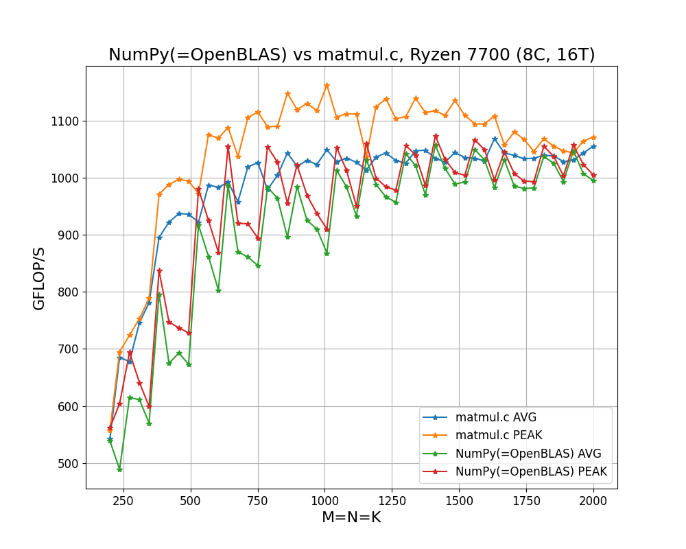
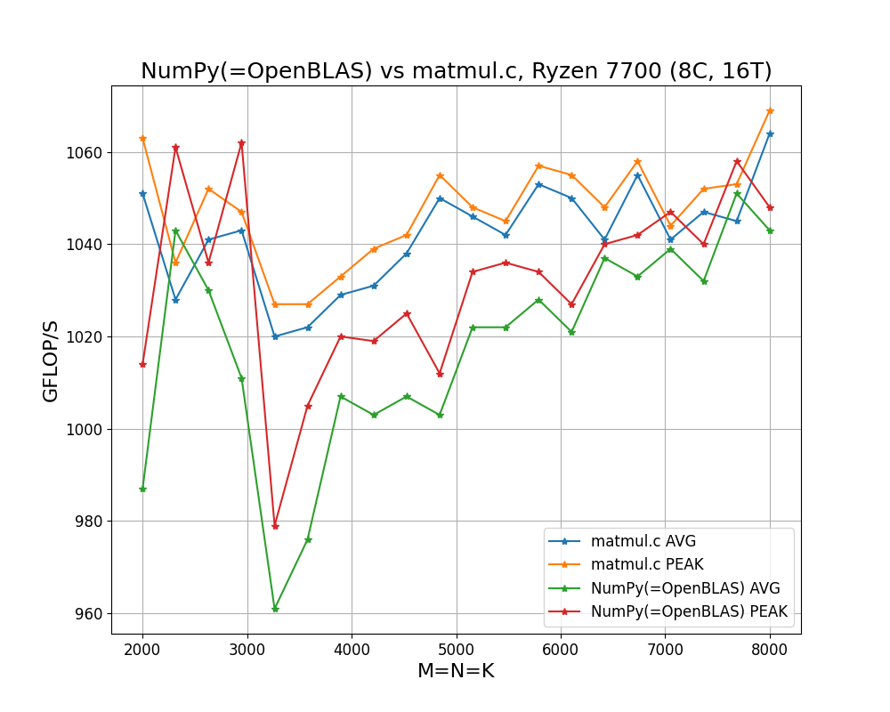

# High-Performance Matrix Multiplication in C

  

## Key Features
- Simple, portable and scalable C code
- Step by step [tutorial](https://salykova.github.io/matmul-cpu)
- Targets x86 processors with AVX and FMA instructions (=all modern Intel Core and AMD Ryzen CPUs)
- Faster than NumPy when fine-tuned for Ryzen 7700
- Efficiently parallelized with just 3 lines of OpenMP directives
- Follows the [BLIS](https://github.com/flame/blis) design
- Works for arbitrary matrix sizes
## Performance

  

  

